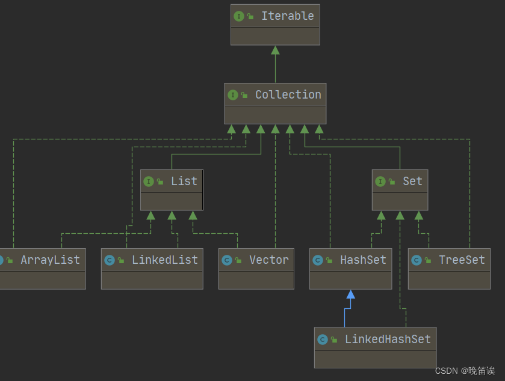
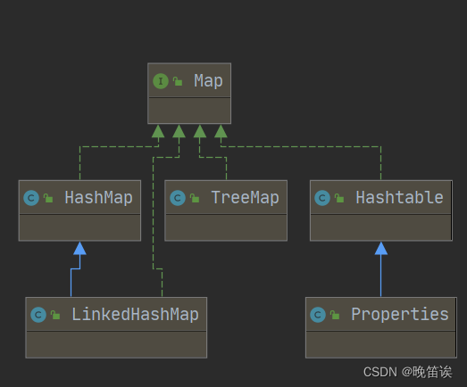
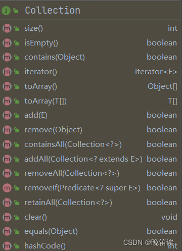
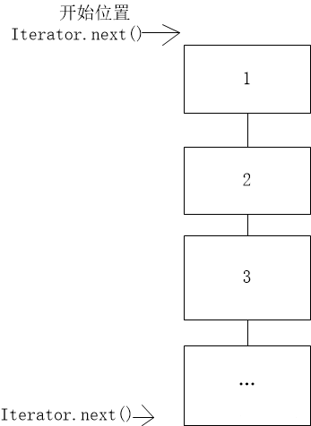

### 一、集合基本框架结构

> java集合基本结构可分为两大类：collection和Map两种体系、
>
> 1、collection接口:单列数据，定义了存取一组对象的方法的集合。
>
> 2、Map接口：双列数据，保存具有映射关系“key-value对”的集合。

1、collection常用子接口：List接口（其中List常用子接口又有ArrayList、LinkedList、Vector... ）、Set接口（其中Set子接口又有HashSet、TreeSet、LinkedHashSet）



 2、Map常用子接口：Hashtable，LinkedHashMap，HashMap，TreeMap、Properties




- Collection接口：单列集合，用来存储一个一个的对象
       List接口：一种包含有序元素的线性表，可存储有序的、可重复的数据。
                      可以存放多个null值。      -->“动态”数组
             ArrayList：作为List接口的主要实现类,多用于频繁的改查操作,线程不安全的,效率高;
                             底层采用Object[] elementData数组存储。
             LinkedList:对于频繁的插入删除操作,使用此类效率比ArrayList效率高,线程也不安全                                     
                             底层采用双向链表存储
             Vector：作为List的古老实现类，线程安全的，效率低;
                             底层采用Object[]数组存储
             
-  Set接口：存储无序的、不可重复的数据   -->数学概念上的“集合”
         HashSet：作为Set接口主要实现类;线程不安全;可以存null值
                       底层采用数组+链表+红黑树
         		LinkedHashSet：作为HashSet的子类;遍历其内部数据时，可以按照添加顺序遍历;对于频繁的遍历操作，LinkedHashSet效率高于HashSet.
                        底层采用数组+双向链表+红黑树
         TreeSet：可以按照添加对象的指定属性，进行排序。
                         底层采用红黑树
- Map:双列数据，存储key-value对的数据
       HashMap:作为Map的主要实现类；线程不安全的，效率高；可存储key和value可以为null,且值（value）可以存在多个null，键（key）只能出现一个null，若key中出现多个null，其结果是对第一个null的值进行覆盖
            LinkedHashMap:保证在遍历map元素时，可以照添加的顺序实现遍历。
                      原因：在原的HashMap底层结构基础上，添加了一对指针，指向前一个和后一个元素。对于频繁的遍历操作，此类执行效率高于HashMap。
       TreeMap:保证照添加的key-value对进行排序，实现排序遍历。此时考虑key的自然排序或定制排序，底层使用红黑树
       Hashtable:作为古老的实现类；线程安全的，效率低；不能存储null的key和value
            Properties:常用来处理配置文件。key和value都是String类型

### 二、collection接口

#### 1、collection常用方法




> 1、添加
> add(Object obj)
> addAll(Collection coll)
> 2、获取有效元素个数
> int size()
> 3、清空集合
> void clear()
> 4、判断是否为空集合
> boolean isEmpty()
> 5、是否包含某个元素
> boolean contains(Object obj):是通过元素的equals方法来判断是否是同一个对象
> boolean containsAll(Collection c):也是调用元素的equals方法来比较的。用两个两个集合的元素逐一比较
> 6、删除
> boolean remove(Object obj):通过元素的equals方法判断是否是要删除的那个元素。只会删除找到的第一个元素
> boolean removeAll(Collection coll):取当前集合的差集
> 取两个集合的交集
> boolean retainAll(Collection c):把交集的结果存在当前的集合中，不影响c
> 7、集合是否相等
> boolean equals(Object obj)
> 8、转换成对象数组
> Object [] toArray()
> 9、获取集合对象的哈希值
> hashCode()
> 10、遍历
> iterator()：返回迭代器对象，用于集合遍历

#### 2、Iterator接口的使用（以及JDK 5.0新特性–增强for循环：(foreach循环)的使用）

代码实例：

```java
1. 
   import java.util.ArrayList;
2. import java.util.Collection;
3. import java.util.Iterator;
4.  
5. public class CollectionIterator {
6.  
7. ​    public static void main(String[] args) {
8. ​        Collection col=new ArrayList();
9. ​        col.add(new Book1("许贯中","三国演义",40));
10. ​        col.add(new Book1("曹雪芹","红楼梦",10));
11. ​        col.add(new Book1("吴承恩","西游记",50));
12.  
13. ​        *//Iterator迭代器的使用*
14. ​        *//第一种输出方式，通过调用collection接口的iterator()方法进行输出*
15. ​        Iterator iterator = col.iterator();*//通过使用迭代器来输出每一行元素*
16. ​        while (iterator.hasNext()) {   *//快捷键：itit*
17. ​            Object next =  iterator.next();
18. ​            System.out.println("next="+next);
19. ​        }
20. ​        *//当退出while后，iterator.hasNext()中next已经走到尾部，若继续调用iterator.hasNext()将会报错*
21. ​        *//可以通过 iterator=col.iterator(); 来重置迭代器*
22. ​        
23. ​         
24. ​        *//第二种输出方式*
25. ​        *//使用foreach（底层也通过迭代器实现）*
26. ​        for (Object book:col) {
27. ​            System.out.println("book="+book);
28. ​        }
29. ​    }
30. }
31. class Book1{
32. ​    private String name;
33. ​    private String bookName;
34. ​    private int price;
35.  
36. ​    public Book1(String name,String bookName,int price){
37. ​        this.name=name;
38. ​        this.bookName=bookName;
39. ​        this.price=price;
40. ​    }
41. ​    public String getName() {
42. ​        return name;
43. ​    }
44.  
45. ​    public void setName(String name) {
46. ​        this.name = name;
47. ​    }
48.  
49. ​    public String getBookName() {
50. ​        return bookName;
51. ​    }
52.  
53. ​    public void setBookName(String bookName) {
54. ​        this.bookName = bookName;
55. ​    }
56.  
57. ​    public int getPrice() {
58. ​        return price;
59. ​    }
60.  
61. ​    public void setPrice(int price) {
62. ​        this.price = price;
63. ​    }
64.  
65. ​    @Override
66. ​    public String toString() {
67. ​        return "{" +
68. ​                "name='" + name + '\'' +
69. ​                ", bookName='" + bookName + '\'' +
70. ​                ", price=" + price +
71. ​                '}';
72. ​    }
73. }
```

#### 3、Irerator()方法细节解释 


> ```java
>  Iterator iterator = col.iterator();//获取迭代器对象
> // hasNext():判断游标右边是否还有下一个元素，默认游标都在集合的第一个元素之前。注意：此时只是判断是否有下一个元素，并不移动指针。
> while(iterator.hasNext()){
>   //next():①指针下移 ②将下移以后集合位置上的元素返回
>   Object next = iterator.next();
>   System.out.println("next="+next);
> }
> ```
>
> 



1. 如果iterato.next()指向的内存中如果没有元素会抛出异常
2. 当退出while后，iterator.hasNext()中next已经走到尾部，若继续调用iterator.hasNext()将会报错（若要继续遍历，可通过重置迭代器解决）
3. void remove()方法 ：删除当前指针所指向的元素，一般和next方法一起用，这时候的作用就是删除next方法返回的元素，如果当前指针指向的内存中没有元素，那么会抛出异常