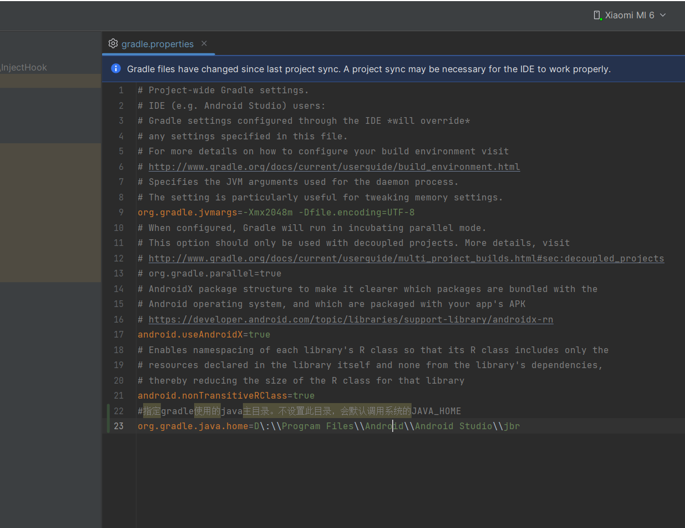

## Python调用Gradle命令

1. 需要设置Java主目录

   #指定gradle使用的java主目录。不设置此目录，会默认调用系统的JAVA_HOME
   org.gradle.java.home=D\:\\Program Files\\Android\\Android Studio\\jbr

   

2. 


​	

```python
import os
import subprocess

import zipfile


def find_apk_files(folder_path):
    apk_files = []

    # 遍历目标文件夹中的所有文件
    for root, dirs, files in os.walk(folder_path):
        for file in files:
            if file.endswith(".apk"):
                apk_file_path = os.path.join(root, file)
                apk_files.append(apk_file_path)

    return apk_files


def find_dex_files(folder_path):
    apk_files = []

    # 遍历目标文件夹中的所有文件
    for root, dirs, files in os.walk(folder_path):
        for file in files:
            if file.endswith(".dex"):
                apk_file_path = os.path.join(root, file)
                apk_files.append(apk_file_path)

    return apk_files


def unzip_apk(apk_file, destination_folder):
    try:
        with zipfile.ZipFile(apk_file, 'r') as zip_ref:
            zip_ref.extractall(destination_folder)
        print(f"APK文件 {apk_file} 已成功解压到 {destination_folder}")
    except Exception as e:
        print(f"解压APK文件时出错：{e}")


def run_shell(command):
    # 要执行的Shell命令
    # command = "adb shell ls -l"  # 以"ls -l"为例，替换为你想要执行的命令

    # 使用subprocess.run执行Shell命令
    try:
        result = subprocess.run(command, shell=True, stdout=subprocess.PIPE, stderr=subprocess.PIPE,
                                text=True)

        # 输出命令的标准输出和标准错误
        # print("标准输出：")
        # print(result.stdout)
        #
        # print("标准错误：")
        # print(result.stderr)

        # 获取命令的返回代码
        return_code = result.returncode
        if return_code == 0:
            print(f"cmd：{command}\treturn_code：{return_code}")
        else:
            print(f"cmd：{command}\treturn_code：{return_code}\t ERR: {result.stderr}")

        return result
    except Exception as e:
        print(f"执行Shell命令时出现错误：{e}")


if __name__ == '__main__':
    current_directory = os.getcwd()
    print("当前目录:", current_directory)

    # run_shell(r".\set_jdk17.bat")
    run_shell(r".\gradlew.bat :WaterSort:clean")
    run_shell(r".\gradlew.bat :WaterSort:assembleRelease")

    target_path = r"./WaterSort/build/outputs/apk"

    apk_list = find_apk_files(target_path)
    for apk_file in apk_list:
        apk_path = os.path.dirname(apk_file)
        zip_path = os.path.dirname(apk_file) + os.path.sep + \
                   os.path.splitext(os.path.basename(apk_file))[
                       0]
        # 使用os.mkdir创建新文件夹
        try:
            os.mkdir(zip_path)
            print(f"已成功创建文件夹：{zip_path}")
        except OSError as e:
            print(f"创建文件夹时出错：{e}")
        print("apk_file: " + apk_file)
        print("apk_path: " + apk_path)
        print("zip_path: " + zip_path)
        unzip_apk(apk_file, zip_path)
        dex_path = zip_path + os.path.sep + r"classes.dex"

        # 解压apk文件，并记录dex文件的地址
        result = run_shell(r"adb devices")
        if result.returncode == 0:
            run_shell(r"adb shell rm -rf /sdcard/hook/hook")
            run_shell(fr"adb push {dex_path} /sdcard/hook/hook")
```