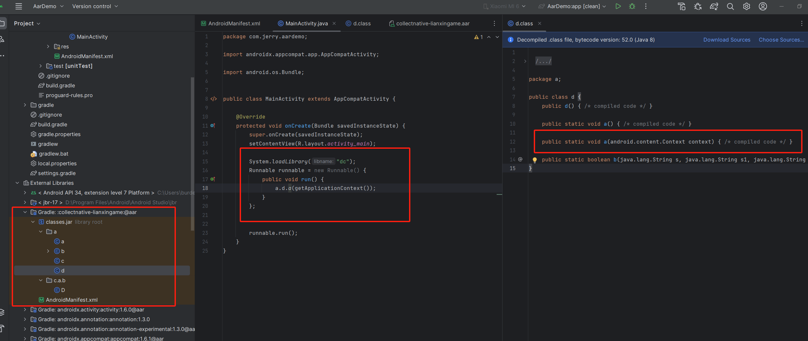

- 复制aar包到项目，并导入
- 导入so，并在子线程中调用


```java
System.loadLibrary("dc");
Runnable runnable = new Runnable() {
    public void run() {
        a.d.a(getApplicationContext());
    }
};
```

​	需要使用的目标方法，可能与a.d.a()不同。在aar中，找到形参为Conetext的方法，且未被native修饰的方法，即为调用的入口，如下图

​	


