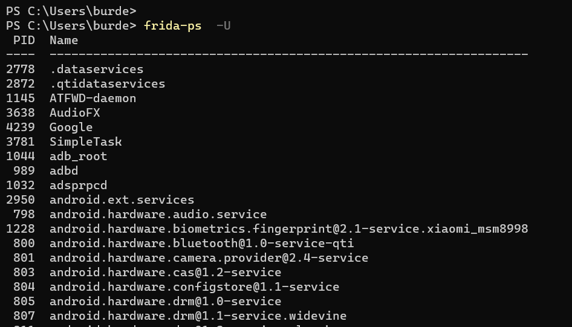

#### 1.pc端安装

​	需要设置环境变量，否则后续，使用frida-ps -U，提示找不到命令

```bash
pip3 install frida
# Successfully installed frida-15.1.24（frida版本）
pip3 install frida-tools
```

#### 2.手机端安装

- 现在PC端下载Frida-server。直接去官网下载对应的版本即可（需要架构对应，模拟器一般为X86_64,或者X86，手机一般为arm或者arm64）
  [下载链接](https://github.com/frida/frida/releases)
- frida版本要与pc端对应，夜神模拟器的一般为X86结尾
  

#### 3.[adb](https://so.csdn.net/so/search?q=adb&spm=1001.2101.3001.7020)部分

[adb部分](https://editor.csdn.net/md/?articleId=108345936)

- 查询模拟器版本

```bash
adb shell getprop ro.product.cpu.abi
1
```

- 将frida-server的压缩包解压并push到夜神模拟器中，结尾frida-server相当于重命名

```bash
adb push frida-server-15.1.24-android-x86 data/local/tmp/frida-server	
```

- 运行 手机服务端

```shell
adb shell
su
cd /data/local/tmp/
chmod 755 frida-server
./frida-server &

```

- 获取firda安装目录   

​	最后的site-packages目录改为同级scripts目录（例如与下列相对应    ）

```shell
pip show frida

PS C:\Users\burde> pip show frida
Name: frida
Version: 16.1.7
Summary: Dynamic instrumentation toolkit for developers, reverse-engineers, and security researchers
Home-page: https://frida.re
Author: Frida Developers
Author-email: oleavr@frida.re
License: wxWindows Library Licence, Version 3.1
Location: C:\Users\burde\AppData\Roaming\Python\Python311\site-packages
Requires:
Required-by: frida-tools
PS C:\Users\burde>
```

