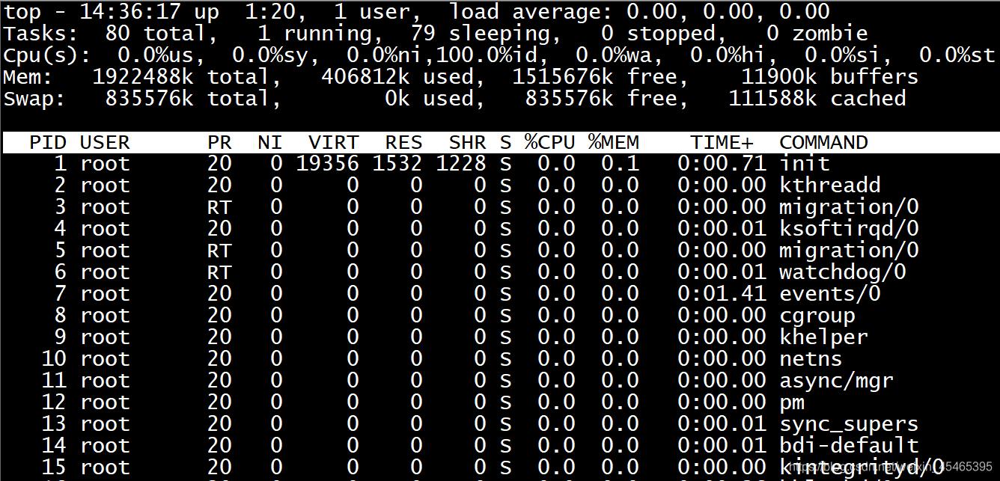

##### linux top命令详解

top的使用方式 top [-d number] | top [-bnp]

| 参数      | 含义                                                         |
| --------- | ------------------------------------------------------------ |
| -d number | number代表秒数，表示top命令显示的页面更新一次的间隔 (default=5s) |
| -b        | 以批次的方式执行top                                          |
| -n        | 与-b配合使用，表示需要进行几次top命令的输出结果              |
| -p        | 指定特定的pid进程号进行观察                                  |

**top命令显示的页面还可以输入以下按键执行相应的功能（注意大小写区分的）**

| 参数 | 含义                                    |
| ---- | --------------------------------------- |
| ？   | 显示在top当中可以输入的命令             |
| P    | 以CPU的使用资源排序显示                 |
| M    | 以内存的使用资源排序显示                |
| N    | 以pid排序显示                           |
| T    | 由进程使用的时间累计排序显示            |
| k    | 给某一个pid一个信号,可以用来杀死进程(9) |
| r    | 给某个pid重新定制一个nice值（即优先级)  |
| q    | 退出top（用ctrl+c也可以退出top）        |

**top各输出参数含义**

###### 一、top前五条信息解释

**top - 14:49:28 up 1:33, 1 user, load average: 0.00, 0.00, 0.00**

| 内容                           | 含义                                                         |
| ------------------------------ | ------------------------------------------------------------ |
| 14:49:28                       | 表示当前时间                                                 |
| up 1:33                        | 系统远行时间，格式为时：分                                   |
| 1 user                         | 当前登陆用户数                                               |
| load average: 0.00, 0.00, 0.00 | 系统负载，即任务队列的平均长度。 三个数值分别为 1分钟、5分钟、15分钟前到现在的平均值 |

**Tasks: 80 total, 2 running, 78 sleeping, 0 stopped, 0 zombie**

| 内容            | 含义             |
| --------------- | ---------------- |
| Tasks: 80 total | 进程总数         |
| 2 running       | 正在运行的进程数 |
| 78 sleeping     | 睡眠的进程数     |
| 0 stopped       | 停止的进程数     |
| 0 zombie        | 僵尸进程数       |

**Cpu(s): 0.0%us, 0.0%sy, 0.0%ni,100.0%id, 0.0%wa, 0.0%hi, 0.0%si, 0.0%st**

| 内容     | 含义                                               |
| -------- | -------------------------------------------------- |
| 0.0%us   | 用户空间占用CPU百分比                              |
| 0.0%sy   | 内核空间占用CPU百分比                              |
| 0.0%ni   | 用户进程空间内改变过优先级的进程占用CPU百分比      |
| 100.0%id | 空闲CPU百分比                                      |
| 0.0%wa   | 等待输入输出的CPU时间百分比                        |
| 0.0%hi   | 硬中断（Hardware IRQ）占用CPU的百分比              |
| 0.0%si   | 软中断（Software Interrupts）占用CPU的百分比       |
| 0.0 st   | 用于有虚拟cpu的情况，用来指示被虚拟机偷掉的cpu时间 |

**Mem: 1922488k total, 406936k used, 1515552k free, 11940k buffers**

| 内容           | 含义                 |
| -------------- | -------------------- |
| 1922488k total | 物理内存总量         |
| 406936k used   | 使用的物理内存总量   |
| 1515552k free  | 空闲内存总量         |
| 11940k buffers | 用作内核缓存的内存量 |

**Swap: 835576k total, 0k used, 835576k free, 111596k cached**

| 内容           | 含义             |
| -------------- | ---------------- |
| 835576k total  | 交换区总量       |
| 0k used        | 使用的交换区总量 |
| 835576k free   | 空闲交换区总量   |
| 111596k cached | 缓冲的交换区总量 |

###### 二、进程信息

| **列名** | **含义**                                                     |
| -------- | ------------------------------------------------------------ |
| PID      | 进程id                                                       |
| USER     | 进程所有者的用户名                                           |
| PR       | 优先级                                                       |
| NI       | nice值。负值表示高优先级，正值表示低优先级                   |
| VIRT     | 进程使用的虚拟内存总量，单位kb。VIRT=SWAP+RES                |
| RES      | 进程使用的、未被换出的物理内存大小，单位kb。RES=CODE+DATA    |
| SHR      | 共享内存大小，单位kb                                         |
| S        | 进程状态。D=不可中断的睡眠状态 R=运行 S=睡眠 T=跟踪/停止 Z=僵尸进程 |
| %CPU     | 上次更新到现在的CPU时间占用百分比                            |
| %MEM     | 进程使用的物理内存百分比                                     |
| TIME+    | 进程使用的CPU时间总计，单位1/100秒                           |
| COMMAND  | 命令名/命令行                                                |

默认进入top时，各进程是按照CPU的占用量来排序的。