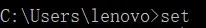
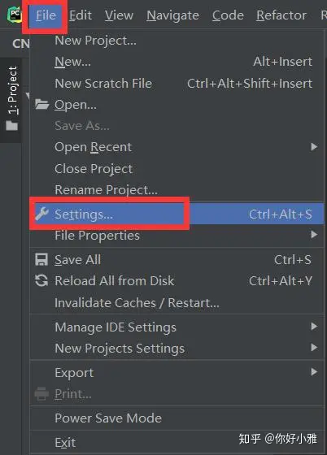
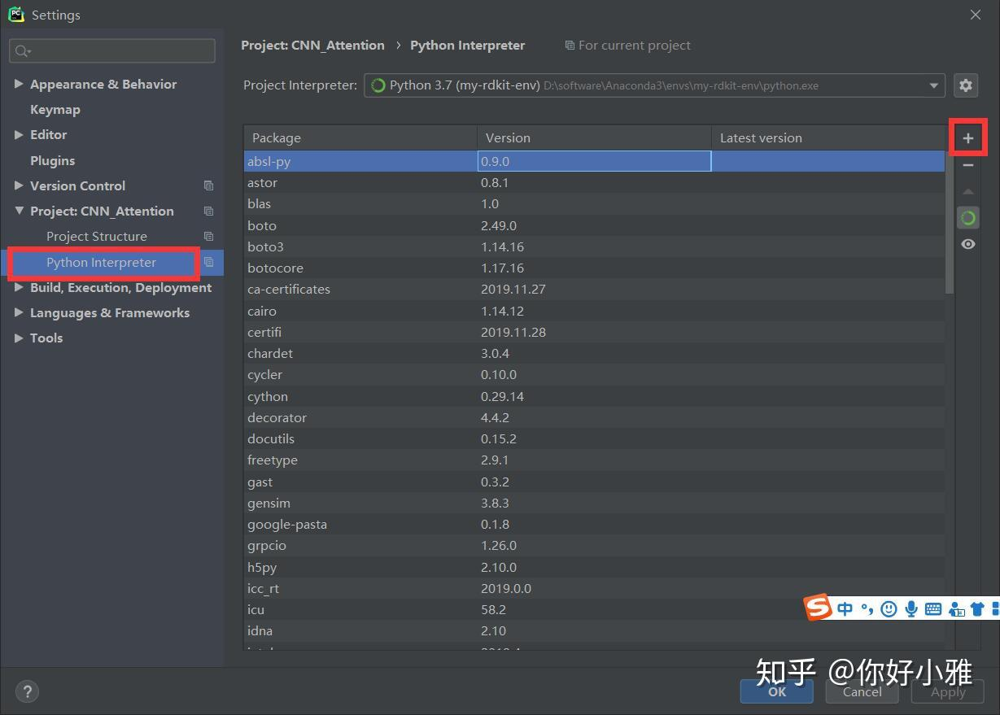
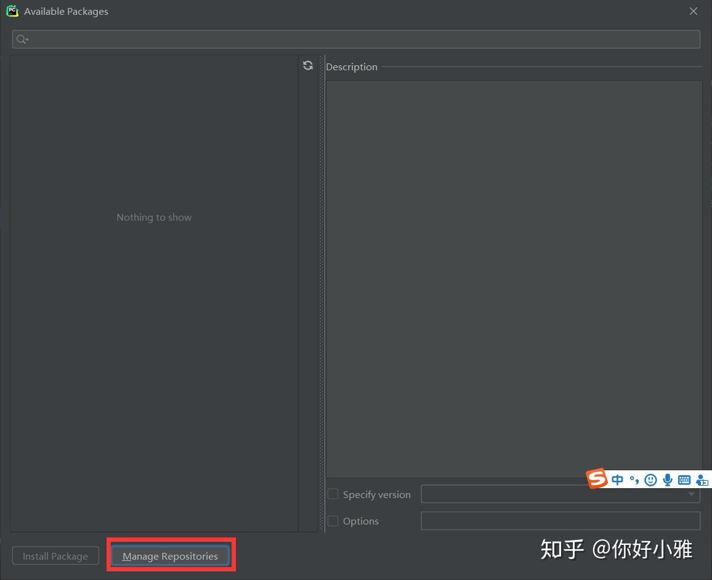
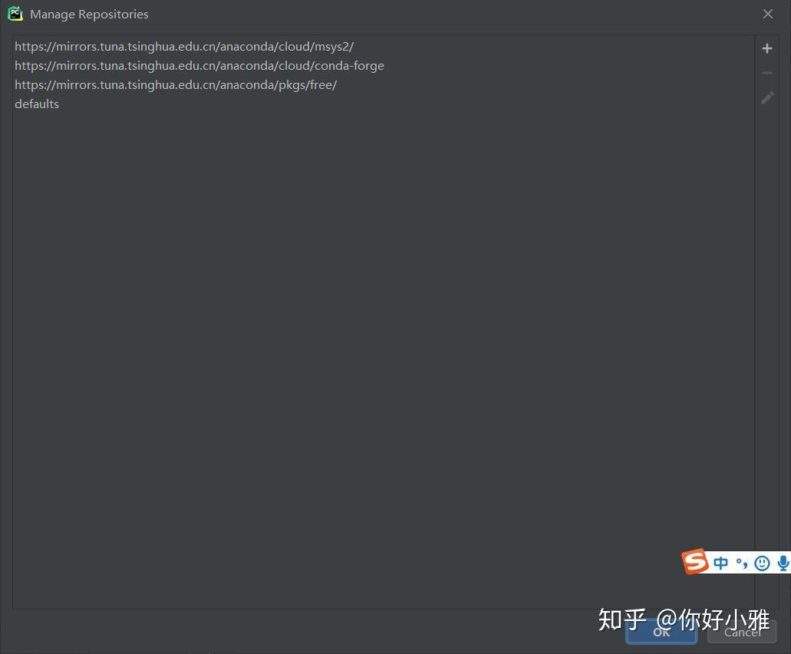

## 临时加速

在不修改配置信息的情况下，我们可以临时使用国内的镜像站来提高下载速度，以使用清华源为例子：

```text
pip install -i https://pypi.tuna.tsinghua.edu.cn/simple package_name
```

清华的镜像源每五分钟更新一次，大而全，推荐大家使用。国内还有其他镜像源可供选择[[3\]](https://zhuanlan.zhihu.com/p/160937471#ref_3)：

```text
清华：https://pypi.tuna.tsinghua.edu.cn/simple
阿里云：http://mirrors.aliyun.com/pypi/simple/
中国科技大学 https://pypi.mirrors.ustc.edu.cn/simple/
华中理工大学：http://pypi.hustunique.com/
山东理工大学：http://pypi.sdutlinux.org/ 
豆瓣：http://pypi.douban.com/simple/
```

## 永久加速

临时加速不太方便，每次安装库时必须带上镜像源的网址。若想减少麻烦，那就要修改配置信息，默认使用镜像源，配置好后只要输入`pip install package_name`，就可以快速安装库了。

### windows下，方法1：

1. 打开cmd输入set命令查看用户目录USERPROFILE；




2. 在user目录中创建一个pip目录,如C:\Users\lenovo\pip，在其中新建文件pip.ini，内容如下：

```text
[global]
index-url = https://pypi.tuna.tsinghua.edu.cn/simple
```

### windows下，方法2：

命令行输入：

```text
pip config set global.index-url https://pypi.tuna.tsinghua.edu.cn/simple
```

执行后就配置好了。

### windows下，方法3：

添加清华的源：[[4\]](https://zhuanlan.zhihu.com/p/160937471#ref_4)

```text
conda config --add channels https://mirrors.tuna.tsinghua.edu.cn/anaconda/pkgs/free/
conda config --add channels https://mirrors.tuna.tsinghua.edu.cn/anaconda/cloud/conda-forge 
conda config --add channels https://mirrors.tuna.tsinghua.edu.cn/anaconda/cloud/msys2/
# 设置搜索时显示通道地址
conda config --set show_channel_urls yes
```

添加中科大的源：[[4\]](https://zhuanlan.zhihu.com/p/160937471#ref_4)

```text
conda config --add channels https://mirrors.ustc.edu.cn/anaconda/pkgs/main/
conda config --add channels https://mirrors.ustc.edu.cn/anaconda/pkgs/free/
conda config --add channels https://mirrors.ustc.edu.cn/anaconda/cloud/conda-forge/
conda config --add channels https://mirrors.ustc.edu.cn/anaconda/cloud/msys2/
conda config --add channels https://mirrors.ustc.edu.cn/anaconda/cloud/bioconda/
conda config --add channels https://mirrors.ustc.edu.cn/anaconda/cloud/menpo/
conda config --set show_channel_urls yes
```

### Pycharm中使用镜像源

有些小伙伴们使用的是Pycharm构建了项目，然后采用了虚拟的环境配置（一个项目一个环境），从而避免了系统中环境混乱。下面教大家如何在Pycharm中通过镜像源来下载第三方库。

1. 点击File→Settings；



2. 点击Python Interpreter→+；



3. 点击Manage Repositories；



4. 点击+就可以进行添加，或者选中已存在条目进行修改，点击OK进行保存。

