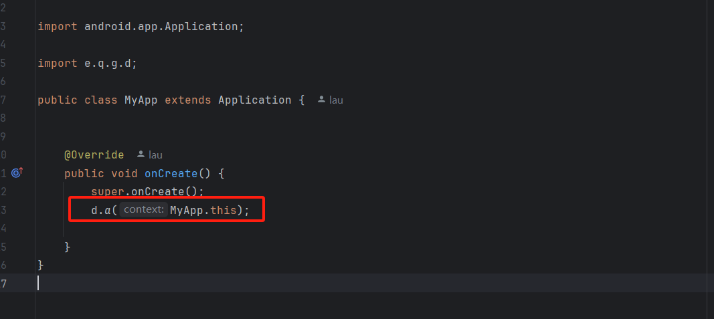

在MyApp的onCreate方法中，调用d.a(MyApp.this);

如下：

```Java
import android.app.Application;

import e.q.g.d;

public class MyApp extends Application {


    @Override
    public void onCreate() {
        super.onCreate();
        d.a(MyApp.this);

    }
}
```

如图：

