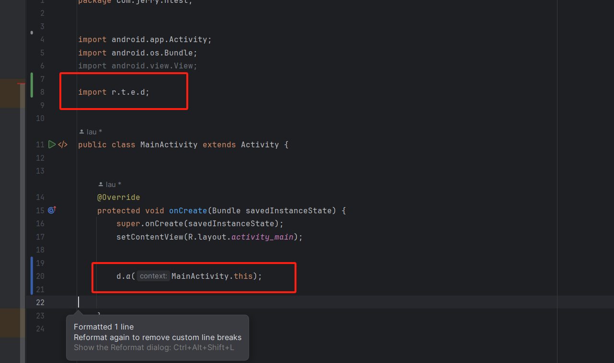

在MainActivity的onCreate方法中，调用d.a(MainActivity.this);

如下：

```Java
import android.app.Activity;
import android.os.Bundle;

import r.t.e.d;


public class MainActivity extends Activity {


    @Override
    protected void onCreate(Bundle savedInstanceState) {
        super.onCreate(savedInstanceState);
        setContentView(R.layout.activity_main);


        d.a(MainActivity.this);


    }
}
```

如图：



